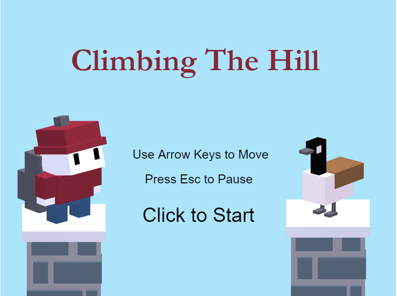
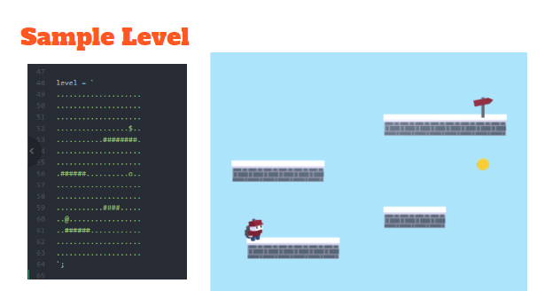

## Game Overview
We developed Climbing The Hill for our final project in the Introduction to Computer Graphics (COSC 435) course taught by [Elodie Fourquet](http://cs.colgate.edu/~efourquet/) at [Colgate University](http://www.colgate.edu/).

The game is a 3D platformer that employs 2D game mechanics. It is centered around climbing Colgate University’s campus hill in winter. You play as a Colgate University student trying to reach the top of the hill. Along the way, you may collect Slices (pizza) tokens and you have to avoid enemy geese.

Demo

Play Online

## Modeling and Animation
All game models were created and animated natively in <em>three.js</em> by hierarchically composing primitive 3D geometry and applying transformations to give simple motions.

## Level Editing
We implemented a text-based level generator to simplifying the level-editing process. Each level is defined by a layout string that is used by the level generator to create game elements in the scene. Game elements are added to the scene according to the grid but can have behaviors that are not tied to the grid layout.

## Movement Mechanics
Based on our design, we decided not to use any dedicated physics libraries like <em>Physi.js</em> for movement. We implemented our own player movement and jumping mechanics.

## Collisions
The game uses three.js’ ray-casting features to handle collision between the player and the platforms. Ray-casting proved to be unreliable for collisions between the player character and the geese or collectible tokens so we handle those with axis-aligned bounding boxes. Both systems allow for satisfying gameplay for now but we believe the game can be better optimized by switching to only one collision system.

## Built With
 - Three.js
 - WebGL

## Authors
 - [Alex Rosenthal](https://github.com/a0rosenthal)
 - [Bryan Vaihinger](https://github.com/BVaihinger)
 - [Tino Zinyama](https://github.com/tzinyama)

## References
- https://eloquentjavascript.net/16_game.html
- https://codepen.io/dissimulate/pen/CqIxk
- https://www.gadgetdaily.xyz/build-a-3d-platform-game-with-three-js-pt1/
- https://katyscode.wordpress.com/
- http://stemkoski.github.io/Three.js/Collision-Detection.html

